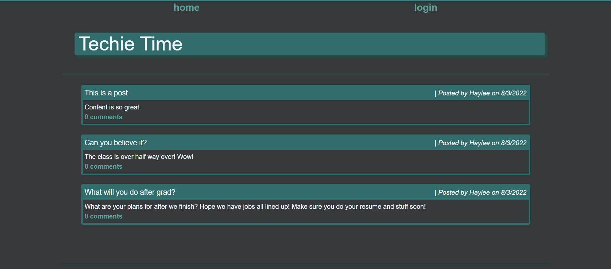

# Techie Time
# ServeStack

## Description 

This website allows users to make, edit, and delete posts. It allows users to comment on theirs and other's posts. It features the ability to log one out after a set amount of time. Log ins are saved to the system so users can keep coming back.

[Techie Time](https://techie-time.herokuapp.com/)

## Table of Contents 

[Description](#description)
[Installation](#installation)
[Usage](#usage)
[License](#license)
[Contribute](#contribute)
[Tests](#tests)
[Questions](#questions)
 
## Installation

To install Techie Time, copy the github repository link, and clone down the repository in desired folder. Use NPM install to install needed dependencies.

## Usage

This application would be useful to anyone wanting to start a blog website allowing users to interact with either other.

## License

No license used

## Contribute

This Application doesn't accept contributions.

## Tests

Jest was used for testing

## Questions

GitHub: [Elenalaree](https://github.com/elenalaree)

